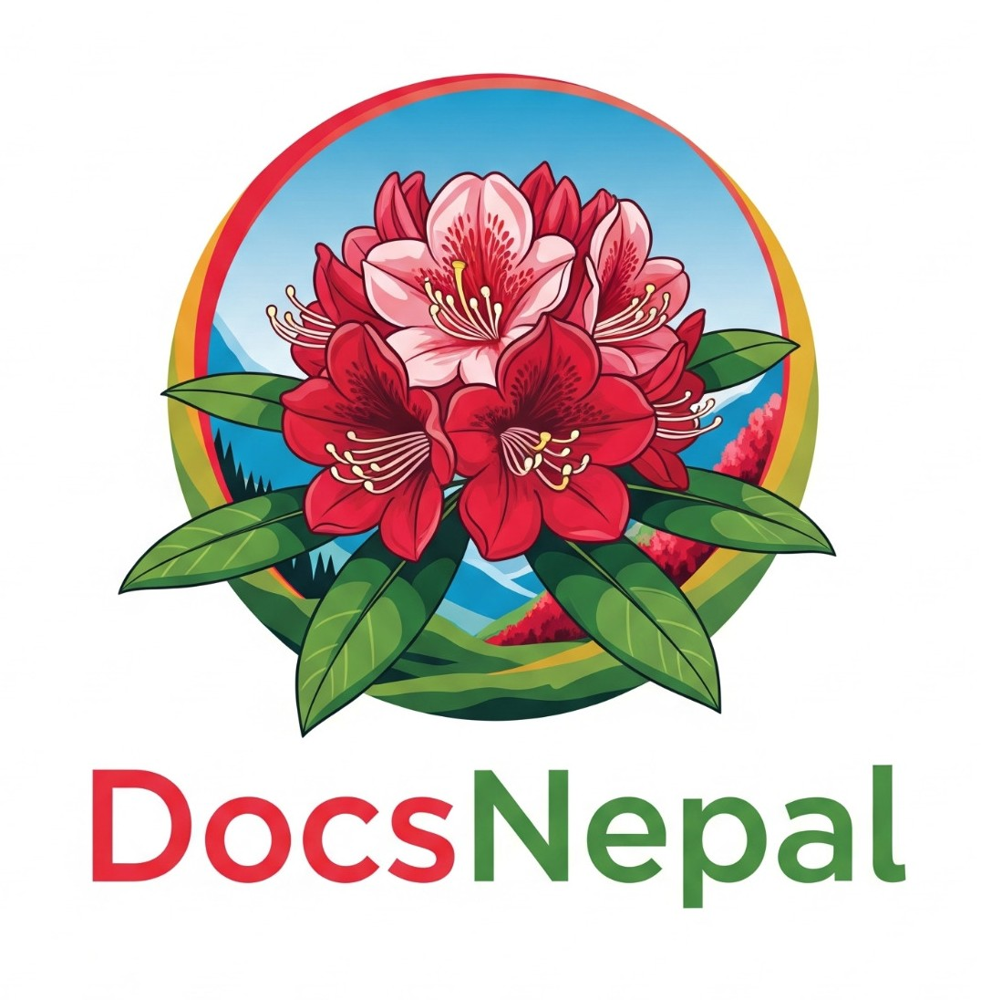

<p align="center">
  
</p>

<h1 align="center">📄 DocsNepal</h1>

<p align="center">
  A smart platform to generate official Nepali documents — job applications, affidavits, sifaris letters, and more — in both <strong>Nepali</strong> and <strong>English</strong> formats.
</p>

<p align="center">
  <a href="https://docsnepal.vercel.app" target="_blank">🌐 Live Demo</a> •
  <a href="https://github.com/pradipchaudhary/docsnepal/issues">🐞 Report Issue</a> •
  <a href="https://github.com/pradipchaudhary">👨‍💻 Author</a>
</p>

---

## 🚀 Overview

> Navigating official paperwork in Nepal can be frustrating and overwhelming.

**DocsNepal** simplifies this process by providing legally accurate, easy-to-edit document templates through a form-based, multilingual interface. No signup required. No personal data stored. Just fill and print.

---

## ✨ Features

- 📝 **Supports Nepali & English Documents**  
- ⚙️ **Form-to-Document Automation**  
- 📄 **Export as PDF or Word (.docx)**  
- 🧾 **Legally Accurate, Predefined Templates**  
- 🔒 **Privacy-Focused — No Login Required**  
- 📱 **Responsive & Mobile-Optimized Design**  
- 📘 **Simple UX with Clear Instructions**

---

## 📚 Use Cases

- ✅ Job Applications (Nepali / English)  
- ✅ Affidavits / Self Declarations  
- ✅ Citizenship Recommendation Letters  
- ✅ School / College Letters  
- ✅ Government Forms & Nibedan  
- ✅ Sifaris & Administrative Requests  

---

## 🧰 Tech Stack

| Technology | Purpose |
|------------|---------|
| [Next.js](https://nextjs.org) | React-based framework with SSR support |
| [Nextra](https://nextra.site) | Markdown-based site generator |
| [React Hook Form](https://react-hook-form.com) | Form state management |
| [html2pdf.js](https://ekoopmans.github.io/html2pdf.js/) | PDF export functionality |
| [docx](https://github.com/dolanmiu/docx) | DOCX document generation |
| [Tailwind CSS](https://tailwindcss.com) | Utility-first CSS styling |
| [Vercel](https://vercel.com) | Hosting & Continuous Deployment |

---

## 🚧 Roadmap

- [ ] Add custom document branding option  
- [ ] Upload user signature/photo for personalization  
- [ ] Save as draft (localStorage only)  
- [ ] Multi-language toggle for each document  
- [ ] Community-submitted templates

---

## 🛡 License

This project is licensed under the [MIT License](./LICENSE).  
Free for personal and commercial use.

---

## 👨‍💻 Author

Built with ❤️ by [**Pradip Chaudhary**](https://github.com/pradipchaudhary)  
📫 Feel free to connect for contributions, improvements, or collaborations.

---

## 📌 Repository Info

- **Repo:** [docsnepal](https://github.com/pradipchaudhary/docsnepal)  
- **Topics:** `nepal`, `official-documents`, `forms`, `nextjs`, `tailwindcss`, `pdf-generator`, `docx`, `nibedan`, `sifaris`, `affidavit`

---

## 📈 SEO Meta Tags (for Vercel/Next.js pages)

```html
<meta name="title" content="DocsNepal – Smart Document Generator for Nepal">
<meta name="description" content="Generate official Nepali documents like job applications, affidavits, and sifaris letters in both Nepali and English formats using smart form-to-document automation.">
<meta name="keywords" content="DocsNepal, Nepal, document generator, job applications, nibedan, sifaris, affidavit, Nepali form app, pdf, docx">
<meta name="author" content="Pradip Chaudhary">
<meta name="viewport" content="width=device-width, initial-scale=1.0">
